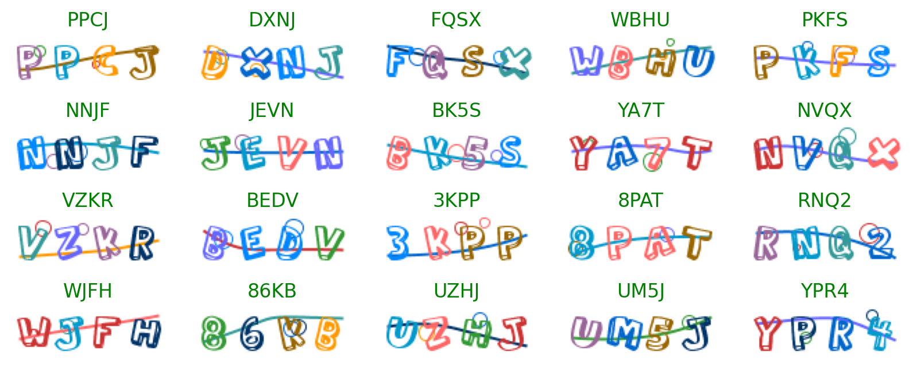
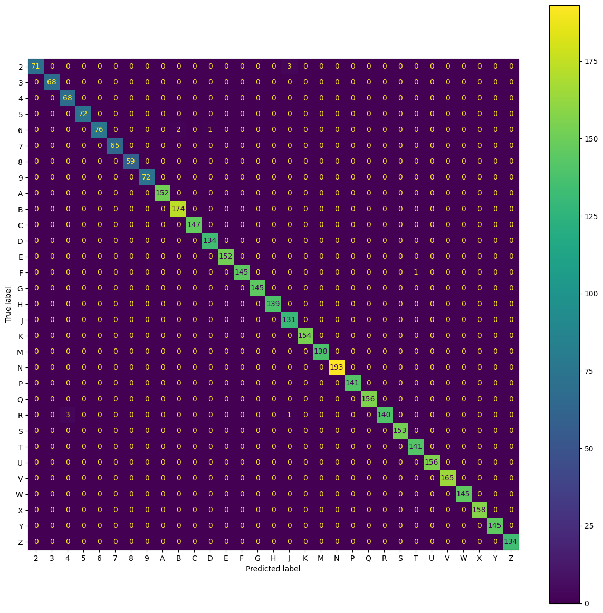
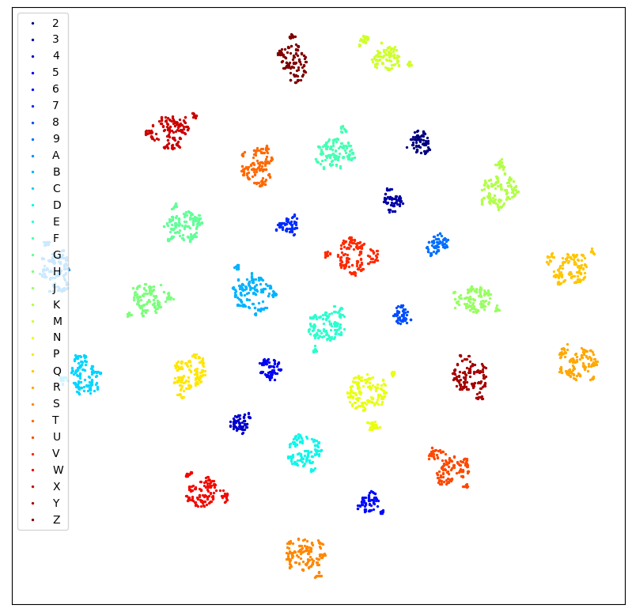

# EasyCaptcha solver

A [EasyCaptcha](https://github.com/pig-mesh/easy-captcha) solver based on PCA and SVM

## Usage

### Running locally

1. Clone this Repository
2. Install requirements
3. Unzip captcha.zip
4. Open captcha_clf.ipynb in Jupyter Notebook

## Datasets

### Training set

* 50 Labeled Captcha
* 450 Unlabeled Captcha

### Test set

* 1000 Labeled Captcha

## Result
* Captcha Accuracy: 98.9%
* Characters Overall Acc: 99.72%
* Characters Average Acc: 99.64%
### Confusion Matrix

### Visualization of features
